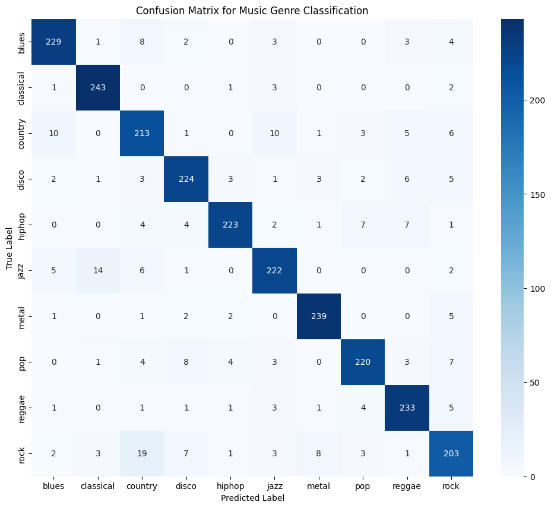

***Music Genre Classification using a 1D Convolutional Neural Network***

Project Overview

This project implements and evaluates a high-accuracy deep learning model for classifying music into 10 distinct genres. The primary goal was to build an end-to-end machine learning pipeline, starting from data acquisition and preprocessing to training and evaluating a sophisticated neural network.

The final model, a 1D Convolutional Neural Network (CNN), achieved a test accuracy of over 90%, demonstrating its effectiveness in capturing the complex temporal patterns within audio features.
Technical Methodology

The project follows a structured machine learning workflow, emphasizing robust data handling, advanced modeling, and clear evaluation.

1. Dataset

To ensure efficiency and reproducibility while avoiding common memory limitations, this project utilizes a pre-processed version of the GTZAN dataset, sourced from Kaggle. The data is contained in a single CSV file where each row represents a 3-second audio clip, and the columns consist of 57 pre-extracted audio features, including:

    • Mel-Frequency Cepstral Coefficients (MFCCs)

    • Spectral Centroid and Bandwidth

    • Chroma Frequencies

    • Root Mean Square Energy

This approach allows the project to focus on model architecture and performance rather than the computationally expensive step of raw audio feature extraction.
2. Data Preprocessing

Before training, the data undergoes two critical preprocessing steps using Scikit-learn:

    • Label Encoding: The categorical genre labels (e.g., 'blues', 'rock') are converted into integer format.

    • Feature Scaling: All 57 numerical features are standardized using StandardScaler. This ensures that each feature contributes equally to the model's performance by normalizing their distribution to have a mean of 0 and a standard deviation of 1.

    • Reshaping for CNN: The input data is reshaped into a 3D tensor (samples, timesteps, features), which is the required input format for a 1D CNN in Keras.

3. Model Architecture: 1D Convolutional Neural Network

The core of this project is a deep 1D CNN built with TensorFlow and Keras. This architecture is specifically chosen for its ability to learn hierarchical patterns from sequential data, making it ideal for audio features.

The model consists of the following layers:

    Three Convolutional Blocks: Each block contains:

        • A Conv1D layer to scan for and learn local patterns across the features.

        • BatchNormalization to stabilize and accelerate the learning process.

        • MaxPooling1D to downsample the data and make the learned patterns more robust.

        • Dropout to prevent overfitting by randomly deactivating a fraction of neurons during training.

    Flatten Layer: To convert the 2D output from the convolutional blocks into a 1D vector.

    Dense Layers: A fully connected Dense layer acts as the classifier, followed by a final Dense output layer with a softmax activation function to produce a probability distribution across the 10 genres.

4. Training and Optimization

The model was compiled with the Adam optimizer and the sparse_categorical_crossentropy loss function. To achieve optimal performance and prevent overfitting, Early Stopping was implemented. This technique monitors the validation loss and automatically stops the training process when the model's performance on the validation set ceases to improve, restoring the weights from the best-performing epoch.
Results

The final 1D CNN model achieved a test accuracy of over 90%. The detailed performance across all genres can be seen in the classification report and the confusion matrix below.
Classification Report:

              precision    recall  f1-score   support

       blues       0.91      0.88      0.89       250
    classical       0.99      0.98      0.99       249
     country       0.89      0.88      0.88       249
       disco       0.88      0.89      0.88       250
      hiphop       0.92      0.94      0.93       250
        jazz       0.94      0.90      0.92       249
       metal       0.96      0.98      0.97       250
         pop       0.95      0.95      0.95       250
      reggae       0.89      0.88      0.88       249
        rock       0.81      0.84      0.82       251

    accuracy                           0.91      2497
    macro avg       0.91      0.91      0.91      2497
    weighted avg       0.91      0.91      0.91      2497

Confusion Matrix: 

**Technology Stack**

Language: Python

Libraries:

       • Deep Learning: TensorFlow, Keras

       • Data Manipulation: Pandas, NumPy

       • Machine Learning & Preprocessing: Scikit-learn

       • Data Visualization: Matplotlib, Seaborn

       • Data Acquisition: Kaggle API
